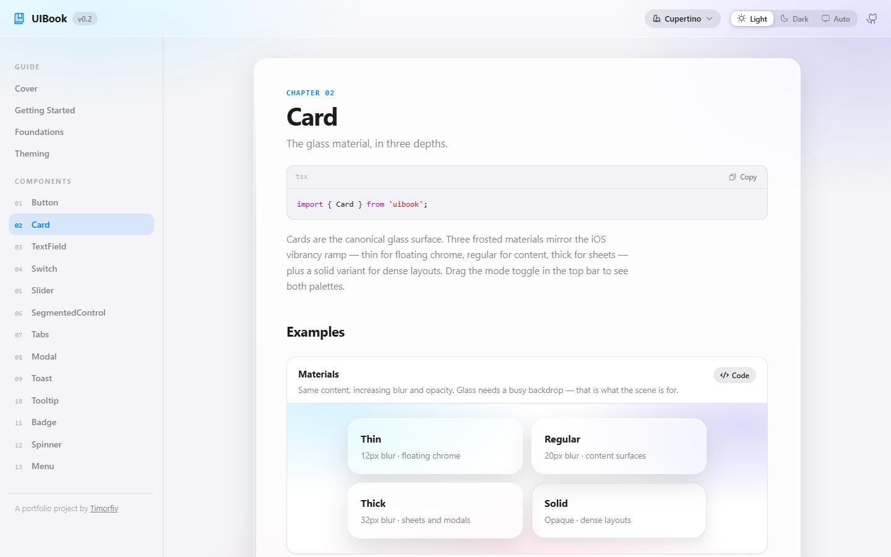
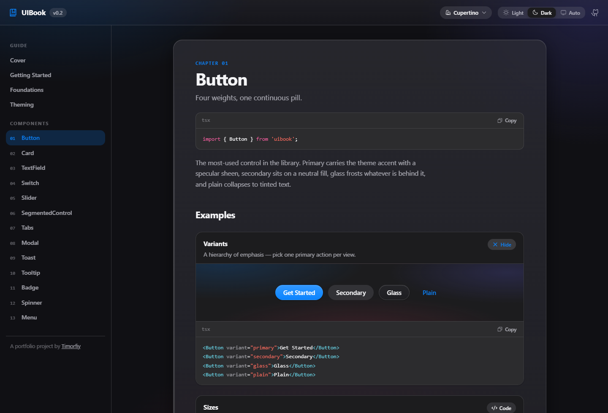

# UIBook

**A React component library you can explore as an interactive book.**

Thirteen components, CSS design tokens and a glass-inspired Cupertino theme. Each chapter brings working examples, source snippets and a prop reference together.

**[Explore the live library →](https://timorfiy.github.io/uibook/)** · [Getting started](https://timorfiy.github.io/uibook/#/getting-started) · [Theming guide](https://timorfiy.github.io/uibook/#/theming)

[](https://github.com/Timorfiy/uibook/actions/workflows/deploy.yml) [](LICENSE)

[](https://timorfiy.github.io/uibook/#/components/card)

*The Card chapter in light mode. The book's navigation, theme controls and examples use the same library.*

[Components](#components) · [Tokens and themes](#tokens-and-themes) · [Motion](#motion-and-materials) · [Accessibility](#accessibility-and-current-limits) · [Run locally](#run-locally)

## Explore the library

UIBook pairs a small React and TypeScript component library with a documentation site built from it. Use the book to compare component states, inspect their props and see how shared tokens affect the interface.

- Switch between **Light, Dark and Auto**; the docs remember your choice and follow OS changes in Auto mode.
- Open a component chapter, interact with its examples and reveal their code.
- Compare **thin, regular, thick and solid** card materials against the same backdrop.
- Read [Foundations](https://timorfiy.github.io/uibook/#/foundations) for token groups and [Theming](https://timorfiy.github.io/uibook/#/theming) for the theme contract.
- Follow previous/next chapter links through the book. Hash routes keep deep links usable on GitHub Pages.



*The Button chapter in dark mode, with the Variants example's code expanded.*

## Components

| Component | Implemented behavior |
| --- | --- |
| [Button](https://timorfiy.github.io/uibook/#/components/button) | Four variants, three sizes, icons, loading and disabled states |
| [Card](https://timorfiy.github.io/uibook/#/components/card) | Three glass materials, a solid surface and optional hover/press styling |
| [TextField](https://timorfiy.github.io/uibook/#/components/textfield) | Linked labels, helper text and caller-supplied error messages |
| [Switch](https://timorfiy.github.io/uibook/#/components/switch) | Controlled or uncontrolled boolean input with switch semantics |
| [Slider](https://timorfiy.github.io/uibook/#/components/slider) | Native range input with a styled track and optional value display |
| [SegmentedControl](https://timorfiy.github.io/uibook/#/components/segmented-control) | Single selection, arrow-key navigation and a moving indicator |
| [Tabs](https://timorfiy.github.io/uibook/#/components/tabs) | Line or pill selectors with arrow-key navigation |
| [Modal](https://timorfiy.github.io/uibook/#/components/modal) | Portal dialog with title, footer, sizes and Escape dismissal |
| [Toast](https://timorfiy.github.io/uibook/#/components/toast) | Provider-based notifications with tone, duration and dismiss controls |
| [Tooltip](https://timorfiy.github.io/uibook/#/components/tooltip) | Delayed hover/focus content with four placement options |
| [Badge](https://timorfiy.github.io/uibook/#/components/badge) | Status labels with semantic tones |
| [Spinner](https://timorfiy.github.io/uibook/#/components/spinner) | CSS rotation with size options and a loading label |
| [Menu](https://timorfiy.github.io/uibook/#/components/menu) | Single-select popup with keyboard navigation and disabled options |

## Tokens and themes

Components share `--uib-*` custom properties for colors, surfaces, glass, radii, shadows and motion. [`base.css`](src/lib/styles/base.css) supplies shared styles, focus rings and material fallbacks. The [Cupertino stylesheet](src/lib/themes/cupertino.css) maps the tokens for light and dark modes, so theme values stay separate from component behavior.

Theme and mode are attributes on the document root:

```html
<html data-uib-theme="cupertino" data-uib-mode="dark">
```

[`applyTheme` and `applyMode`](src/lib/themes/index.ts) set those attributes and save the choice in `localStorage`. The documentation shell separately subscribes to OS color-scheme changes; `applyMode('system')` by itself resolves the current preference once.

**Cupertino is the available theme.** Minimal and Codex are registered as planned and have no theme stylesheets yet.

To add a theme, copy the full token map into a new CSS file, define its light/dark selectors and OS fallback, then import it and register its metadata in [`themes/index.ts`](src/lib/themes/index.ts). An override can flatten Cupertino's glass without changing the React tree:

```css
/* Load after UIBook's styles. */
[data-uib-theme='cupertino'] {
  --uib-glass-thin-blur: 0px;
  --uib-glass-blur: 0px;
  --uib-glass-thick-blur: 0px;
}
```

## Motion and materials

Glass blur stays static. Dialogs, menus and tooltips use CSS transforms and opacity for entry/exit effects; the book adds a page-turn animation. Shared duration and easing tokens coordinate component motion.

Tabs and segmented controls use [`useActiveIndicator`](src/lib/utils/useIndicator.ts) to measure the active item when selection or element sizes change. CSS animates the resulting position and width; there is no JavaScript animation loop. Other state transitions also include colors and shadows, so the implementation is not exclusively transform/opacity.

[`prefers-reduced-motion`](src/lib/styles/base.css) reduces animation and transition durations. Unsupported backdrop filtering and `prefers-reduced-transparency` use opaque surface fallbacks. For content that does not need a translucent backdrop, use `material="solid"`.

These are implementation choices, not a measured frame-rate guarantee. No performance benchmark is included.

## Accessibility and current limits

The library includes visible focus styles, label/error associations, native range inputs, switch and radio semantics, keyboard navigation for menus and selectors, and polite toast announcements. Reduced-motion and reduced-transparency preferences have CSS fallbacks.

Some behavior is still incomplete: Tabs does not manage panels or their ARIA relationships; tab and segmented selectors do not implement roving tab stops. Modal focus restoration and full keyboard containment need work. Interactive Card styling does not supply button/link semantics. See [accessibility notes](docs/accessibility.md) for the source-backed details and integration limits.

UIBook is a source repository with `private: true`, not a packaged npm distribution. The current build produces the documentation site. There are no test or lint scripts in this checkout, and this README does not claim a completed accessibility audit.

## Run locally

Use **Node.js 24 and npm**. No environment variables or backend services are required for local development.

```bash
git clone https://github.com/Timorfiy/uibook.git
cd uibook
npm ci
npm run dev
```

Open [localhost:5173](http://localhost:5173/), or the URL printed by Vite if that port is busy.

| Command | Purpose |
| --- | --- |
| `npm run dev` | Start the documentation site |
| `npm run typecheck` | Check TypeScript without building |
| `npm run build` | Check TypeScript and build the site into `dist/` |
| `npm run preview` | Serve the production build at `/uibook/` |

To use a component **inside this repository**, a file at `src/Example.tsx` can import the public entry point:

```tsx
import { Button, Switch, applyTheme, applyMode } from './lib';

// Run in the browser; the entry point includes base and theme styles.
applyTheme('cupertino');
applyMode('light');

export function Example() {
  return (
    <div>
      <Switch label="Email updates" defaultChecked />
      <Button variant="primary">Save preferences</Button>
    </div>
  );
}
```

The live book uses package-style `from 'uibook'` snippets. In this checkout, use the relative source entry above; there is no published-package installation workflow configured here.

## Architecture

```text
src/
├── lib/
│   ├── index.ts          # public exports and base style import
│   ├── components/       # component logic + local CSS
│   ├── themes/           # theme metadata, helpers and Cupertino tokens
│   ├── styles/base.css   # shared styles, focus rings and fallbacks
│   └── utils/            # class names and indicator measurement
└── docs/
    ├── registry.ts       # component chapters and their order
    ├── components/       # shell, demos, code, prop tables and book navigation
    ├── demos/            # live examples and prop references
    └── pages/            # cover, getting started, foundations and theming
```

React 18 renders the components; the docs add React Router and Phosphor icons. Styling uses plain CSS. A new component gets a public export, a demo/props definition and an entry in [`registry.ts`](src/docs/registry.ts).

## Deployment

The [Pages workflow](.github/workflows/deploy.yml) builds and publishes pushes to `main`. Set **Settings → Pages → Source** to **GitHub Actions**. Production and preview use `/uibook/`; set `UIBOOK_BASE` when building for a different repository path. The [Vite config](vite.config.ts) and [HashRouter](src/docs/App.tsx) handle project-site assets and chapter links.

[MIT License](LICENSE) · [Screenshot capture notes](docs/screenshots.md) · Built by [Timorfiy](https://github.com/Timorfiy)
